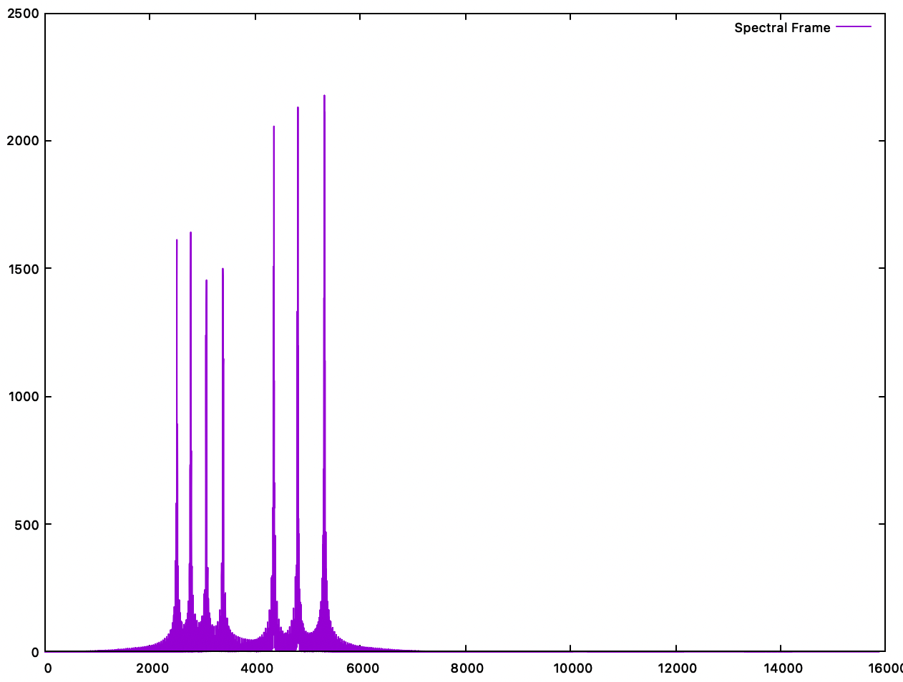

Bastien Soucasse

# Exemple de signal de clavier telephonique – TD 4

## Analyse de fréquences

### Question 1

On doit travailler sur une trame où il n’y a qu’une seule touche à la fois pour ne pas mélanger les fréquences analysées. La durée minimale de pression d’une touche étant 0.2 s, on choisit une durée de trame équivalente.

Durée :\
$t = 0.2 \; \text{s}$

Résolution temporelle :\
$n = F_e t = 8820 \; \text{échantillons}$

Résolution fréquentielle :\
$\Delta f = \frac{F_e}{2 n} = 2.5 \; \text{Hz}$

Il n’y a pas de précautions à prendre. On sait que les fréquences sont éloignées de plus de 2.5 Hz entre elles.

### Question 2

Pour observer tous le spectre, on regarde toute la durée du son. Il y a 12 touches, pressées pendant 0.2 s suivi d’une pause de 0.1 s pour chacune. On doit donc lancer l’analyse avec les paramètres suivants.

Durée :\
$T = 12 * (0.2 + 0.1) = 3.6 \; \text{s}$

Résolution temporelle :\
$N = F_e T = 158760 \; \text{échantillons}$

On observe alors 7 pics. Or, étant donné que chaque touche correspond à 2 fréquences, on devrait en trouver 24. Cela signifie que certaines fréquences sont communes à plusieurs touches.

En écoutant les sons de chaque touche, on peut comprendre qu’une fréquence est commune à toute une ligne ou colonne du pavé de touches. On a donc un total de 4 fréquences pour les lignes et 3 pour les colonnes soit un total de 7 fréquences. C’est effectivement ce que l’on retrouve ici.

### Question 3

En lançant l’analyse pour chaque trame de 0.2 s, on trouve au minimum 2 pics, et 3 au maximum.

En effet, les trames contenant 2 pics sont celles dont une seule touche est préssée durant toute la trame. Alors que s'il y a deux touches préssées durant la trame (fin d'une touche au début de la trame, et début d'une autre à la fin), il y a alors les fréquences des deux touches qui se mélangent.

Le problème est résolu en changeant `HOP_SIZE` à 4410, la taille minimale d'un silence. [?]

### Question 4

Code…

### Question 5

Ayant résolu le problème de superposition de signaux, on devrait trouver deux pics pour chaque frame. Seulement, on en trouve des milliers par frame. Il faudrait conserver les deux plus hauts pics uniquement. 

### Question 6

