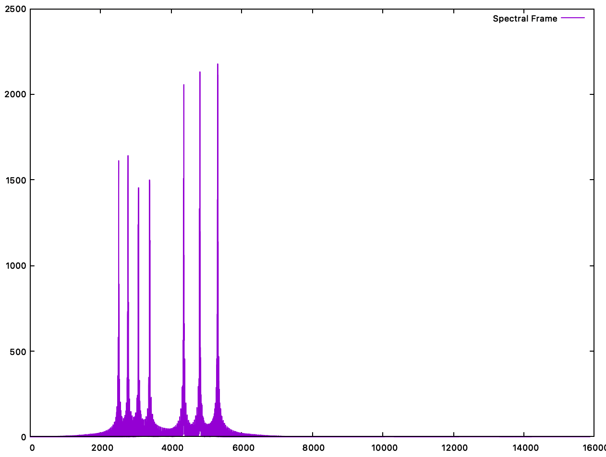
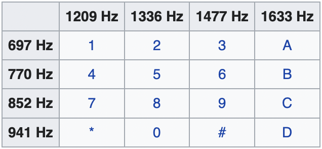

Bastien Soucasse

# Exemple de signal de clavier telephonique – TD 4

## Analyse de fréquences

### Question 1

On cherche à récupérer les fréquences de chaque touche grâce au fichier `telbase.wav`. On doit travailler sur une trame où il n’y a qu’une seule touche à la fois pour ne pas mélanger les fréquences analysées. La durée minimale de pression d’une touche étant 0.2 s, on choisit une durée de trame équivalente.

Durée :\
**t = 0.2 s**

Résolution temporelle :\
**n = F_e t = 8820 échantillons**

Résolution fréquentielle :\
**Df = F_e / n = 5 Hz**

Il n’y a pas de précautions à prendre. On sait que les fréquences sont éloignées de plus de 5 Hz entre elles.

### Question 2

Pour observer tous le spectre, on regarde toute la durée du son. Il y a 12 touches, pressées pendant 0.2 s suivi d’une pause de 0.1 s pour chacune. On doit donc lancer l’analyse avec les paramètres suivants.

Durée :\
**T = 12 * (0.2 + 0.1) = 3.6 s**

Résolution temporelle :\
**N = F_e T = 158760 échantillons**

On observe alors 7 pics. Or, étant donné que chaque touche correspond à 2 fréquences, on devrait en trouver 24. Cela signifie que certaines fréquences sont communes à plusieurs touches.

En écoutant les sons de chaque touche, on peut comprendre qu’une fréquence est commune à toute une ligne ou colonne du pavé de touches. On a donc un total de 4 fréquences pour les lignes et 3 pour les colonnes soit un total de 7 fréquences. C’est effectivement ce que l’on retrouve ici.

### Question 3

En lançant l’analyse pour chaque trame de 0.2 s, on trouve au minimum 2 pics, et 4 au maximum.

En effet, les trames contenant 2 pics sont celles dont une seule touche est préssée durant toute la trame. Alors que s’il y a deux touches préssées durant la trame (fin d’une touche au début de la trame, et début d’une autre à la fin), il y a alors les fréquences des deux touches qui se mélangent.

Le problème est résolu en changeant `HOP_SIZE` à 4410, la taille minimale d’un silence, on va éviter tout chevauchement, on aura donc forcément 2 pics.

### Question 4

Code…

### Question 5

Ayant résolu le problème de superposition de signaux, on devrait stocker deux pics pour chaque frame. Seulement, on en stocke des milliers par frame. Il faudrait conserver les deux plus hauts pics uniquement.

### Question 6

Précision :\
**f_prec = Df / 2 = 2.5 Hz**

Pour améliorer cette précision, on met en place une interpolation parabolique, cela va permettre d’estimer une valeur plus proche de la fréquence exacte du pic.

### Question 7

En analysant les fréquences de chaque touche, on obtient un couple qui correspond de manière très fidèle aux valeurs précisées dans le tableau suivant.

### Question 8

Une fois cette calibration faite, on peut analyser le fichier `telA.wav` « à la main ».

Durée :\
**t = 0.06 s**

Représentation temporelle :\
**n = F_e t = 2646 échantillons**

En analysant chaque frame, on se rend compte que les numéros apparaissent plusieurs fois (plusieurs frames sont sur la même touche), mais qu'ils sont bien séparés par des frames « inutiles ».

On se rend compte que le numéro composé ici est donc 0556846500.

## Détection de touches

En analysant les énergies de chaque frame, on décide de garder les frames dont l'énergie est supérieure à 0.01.

## Analyse de numéros

On ne garde que la première frame d'un numéro (on attend de trouver une frame « inutile » avant de récupérer le prochain numéro), et on stocke ces numéros, pour afficher la totalité à la fin.

On peut alors tester pour tous les fichiers d'entrée :
- `telbase.wav` : 1234567890*#
- `telA.wav` : 0556846500
- `telB.wav` : 227772888666
- `telC.wav` : 0556340548
- `telD.wav` : 0556846500
- `telE.wav` : 0540006000
